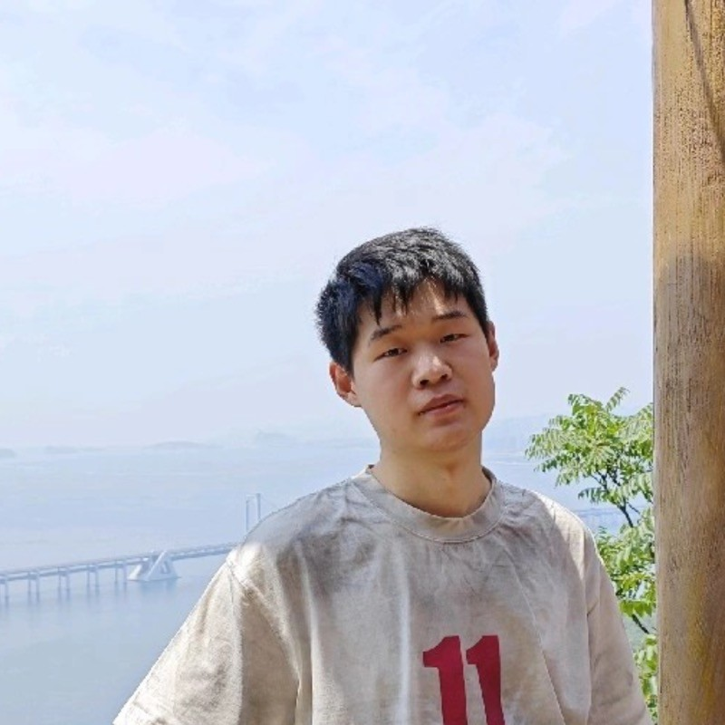

---
hide:
  - toc
---

# Hangxing Wei

  
  

    

      I work on foundation models for embodied agents, focusing on latent action
      modeling, robotics, reinforcement learning, and vision-language-action models.
    

    

      I received my M.Eng. and B.Eng. degrees in Cyber Science and Engineering
      from Wuhan University. I am currently a research intern at Microsoft
      Research Asia, working with
      <a href="https://www.microsoft.com/en-us/research/people/lizo/">Dr. Li Zhao</a>.
    

    

      
      
      
      
    

  

## News

  
2026

  

    
<strong>villa-X</strong> was accepted to ICLR 2026.

  

## Research

My research focuses on learning action representations for embodied agents. I am particularly interested in how latent action spaces can bridge human videos, robot demonstrations, and vision-language-action policies, so that embodied models can learn from broader data sources and transfer more reliably to new tasks.

At a higher level, I aim to build embodied models that can acquire reusable action abstractions, reason over long-horizon behavior, and adapt across embodiments and environments with limited task-specific supervision.

I also work on AI infrastructure for robotics and maintain an interest in agent security, especially prompt injection and secure tool-use behavior.

## Engineering

I enjoy turning repeated workflow friction into small, reliable tools. This includes research infrastructure such as [azure_jobs](https://github.com/HSPK/azure_jobs), a lightweight Azure ML job submission CLI, and [expr_tracker](https://github.com/HSPK/expr_tracker), a simple experiment tracking wrapper over local logs and online backends such as W&B.

I also like building personal utilities that make everyday computing more organized and pleasant. See [Open Source](open-source.md) for selected tools.

## Selected Publication

  
ICLR 2026

  

    <h3><a href="https://arxiv.org/abs/2507.23682">villa-X: Enhancing Latent Action Modeling in Vision-Language-Action Models</a></h3>
    
International Conference on Learning Representations

    
Grounded latent actions in robot dynamics for VLA policy learning, improving simulation and real-world performance with zero-shot latent planning.

    
<a href="https://arxiv.org/pdf/2507.23682">Paper</a> · <a href="https://github.com/microsoft/villa-x">Code</a> · <a href="https://microsoft.github.io/villa-x/">Project Page</a>

  

